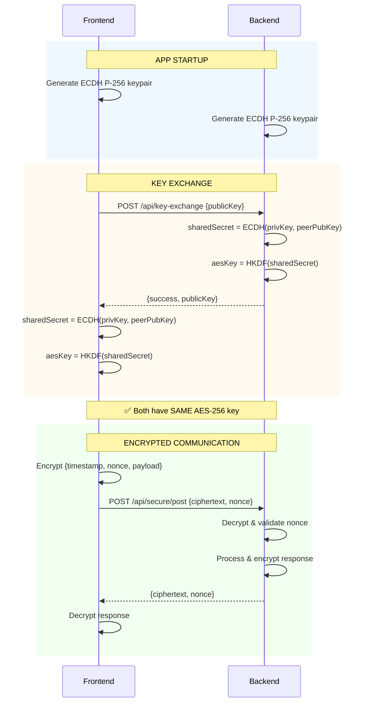
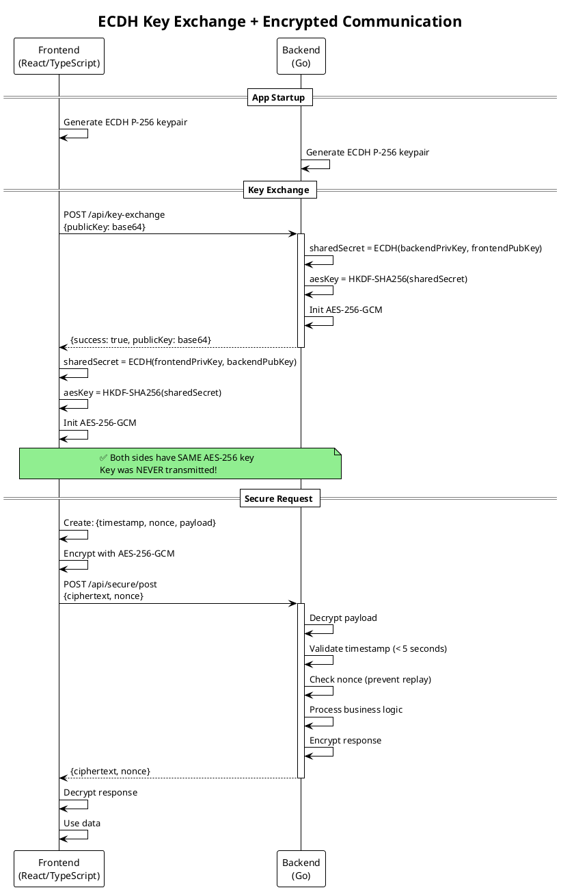

# ECDH Key Exchange Implementation Plan

## Overview

Implement **Elliptic Curve Diffie-Hellman (ECDH)** key exchange to replace the pre-shared key approach for secure communication between the React frontend and Go backend.

## Why ECDH?

### Current Problem (Pre-Shared Key)

- Key is embedded in the JavaScript bundle
- Anyone can extract it from the shipped desktop app
- All users share the same key = no real security
- No Perfect Forward Secrecy (PFS)

### ECDH Benefits

- ✅ No secrets in the bundle
- ✅ Only public keys transmitted (safe even if intercepted)
- ✅ Each session generates unique keys
- ✅ Perfect Forward Secrecy
- ✅ Suitable for public desktop apps

---

## Implementation Architecture

### Key Exchange Flow

```
┌─────────────────────────────────────────────────────────────────────┐
│                         APP STARTUP                                  │
├─────────────────────────────────────────────────────────────────────┤
│                                                                      │
│   FRONTEND (React/TypeScript)           BACKEND (Go)                │
│   ───────────────────────────           ────────────                │
│                                                                      │
│   1. Generate ECDH P-256 keypair        1. Generate ECDH P-256      │
│      - frontendPublicKey                   keypair on startup       │
│      - frontendPrivateKey                  - backendPublicKey       │
│                                            - backendPrivateKey      │
│                                                                      │
│   2. Call POST /api/key-exchange ────►  3. Receive frontend's      │
│      Body: {                               public key               │
│        publicKey: <base64>                                          │
│      }                                  4. Compute shared secret:   │
│                                            ECDH(backendPrivKey,     │
│                                                 frontendPubKey)     │
│                                                                      │
│   6. Receive backend's public key ◄──── 5. Return response:        │
│      Response: {                           { publicKey: <base64> }  │
│        publicKey: <base64>                                          │
│      }                                                              │
│                                                                      │
│   7. Compute shared secret:                                         │
│      ECDH(frontendPrivKey,                                          │
│           backendPubKey)                                            │
│                                                                      │
│   8. Derive AES-256 key using           8. Derive AES-256 key      │
│      HKDF from shared secret               using HKDF               │
│                                                                      │
│   ══════════════════════════════════════════════════════════════════│
│   RESULT: Both sides have the SAME AES-256-GCM key                  │
│           Key was NEVER transmitted over the network!               │
└─────────────────────────────────────────────────────────────────────┘
```

---

## Technical Specifications

### Cryptographic Parameters

| Parameter         | Value                    |
| ----------------- | ------------------------ |
| ECDH Curve        | P-256 (secp256r1)        |
| Key Derivation    | HKDF-SHA256              |
| Symmetric Cipher  | AES-256-GCM              |
| Public Key Format | Base64-encoded raw bytes |

### Why P-256?

- Widely supported (Web Crypto API, Go crypto/elliptic)
- 128-bit security level
- Fast and efficient
- Industry standard (NIST approved)

---

## Backend Implementation (Go)

### New File: `backend/pkg/encryption/ecdh.go`

```go
package encryption

import (
    "crypto/ecdh"
    "crypto/rand"
    "crypto/sha256"
    "encoding/base64"
    "golang.org/x/crypto/hkdf"
    "io"
)

// ECDHManager handles ECDH key exchange
type ECDHManager struct {
    privateKey *ecdh.PrivateKey
    publicKey  *ecdh.PublicKey
}

// NewECDHManager creates a new ECDH manager with generated keypair
func NewECDHManager() (*ECDHManager, error) {
    curve := ecdh.P256()
    privateKey, err := curve.GenerateKey(rand.Reader)
    if err != nil {
        return nil, err
    }
  
    return &ECDHManager{
        privateKey: privateKey,
        publicKey:  privateKey.PublicKey(),
    }, nil
}

// GetPublicKeyBase64 returns the public key as base64 string
func (e *ECDHManager) GetPublicKeyBase64() string {
    return base64.StdEncoding.EncodeToString(e.publicKey.Bytes())
}

// ComputeSharedSecret computes shared secret from peer's public key
func (e *ECDHManager) ComputeSharedSecret(peerPublicKeyBase64 string) ([]byte, error) {
    // Decode peer's public key
    peerPubBytes, err := base64.StdEncoding.DecodeString(peerPublicKeyBase64)
    if err != nil {
        return nil, err
    }
  
    // Parse public key
    curve := ecdh.P256()
    peerPublicKey, err := curve.NewPublicKey(peerPubBytes)
    if err != nil {
        return nil, err
    }
  
    // Compute shared secret
    sharedSecret, err := e.privateKey.ECDH(peerPublicKey)
    if err != nil {
        return nil, err
    }
  
    return sharedSecret, nil
}

// DeriveAESKey derives a 32-byte AES key from shared secret using HKDF
func DeriveAESKey(sharedSecret []byte) ([]byte, error) {
    // Use HKDF to derive AES key
    hkdfReader := hkdf.New(sha256.New, sharedSecret, nil, []byte("aes-key"))
    aesKey := make([]byte, 32) // 256 bits for AES-256
    if _, err := io.ReadFull(hkdfReader, aesKey); err != nil {
        return nil, err
    }
    return aesKey, nil
}
```

### New Endpoint: `/api/key-exchange`

```go
// In main.go

// KeyExchangeRequest represents the key exchange request
type KeyExchangeRequest struct {
    PublicKey string `json:"publicKey"` // Base64 encoded
}

// KeyExchangeResponse represents the key exchange response
type KeyExchangeResponse struct {
    PublicKey string `json:"publicKey"` // Base64 encoded
}

var ecdhManager *encryption.ECDHManager

func handleKeyExchange(w http.ResponseWriter, r *http.Request) {
    // Decode request
    var req KeyExchangeRequest
    if err := json.NewDecoder(r.Body).Decode(&req); err != nil {
        http.Error(w, "Invalid request", http.StatusBadRequest)
        return
    }
  
    // Compute shared secret
    sharedSecret, err := ecdhManager.ComputeSharedSecret(req.PublicKey)
    if err != nil {
        http.Error(w, "Key exchange failed", http.StatusBadRequest)
        return
    }
  
    // Derive AES key
    aesKey, err := encryption.DeriveAESKey(sharedSecret)
    if err != nil {
        http.Error(w, "Key derivation failed", http.StatusInternalServerError)
        return
    }
  
    // Initialize encryption manager with derived key
    securityMgr, err = encryption.NewManagerWithKeyBytes(aesKey)
    if err != nil {
        http.Error(w, "Failed to initialize encryption", http.StatusInternalServerError)
        return
    }
  
    // Return backend's public key
    response := KeyExchangeResponse{
        PublicKey: ecdhManager.GetPublicKeyBase64(),
    }
  
    w.Header().Set("Content-Type", "application/json")
    json.NewEncoder(w).Encode(response)
}

// In main():
// r.Post("/api/key-exchange", handleKeyExchange)
```

---

## Frontend Implementation (TypeScript)

### New File: `frontend/src/lib/crypto/ecdh.ts`

```typescript
/**
 * ECDH Key Exchange using Web Crypto API
 */

export class ECDHKeyExchange {
  private keyPair: CryptoKeyPair | null = null;
  
  /**
   * Generate ECDH P-256 keypair
   */
  async generateKeyPair(): Promise<void> {
    this.keyPair = await window.crypto.subtle.generateKey(
      {
        name: "ECDH",
        namedCurve: "P-256",
      },
      true, // extractable
      ["deriveBits"]
    );
  }
  
  /**
   * Get public key as base64 string
   */
  async getPublicKeyBase64(): Promise<string> {
    if (!this.keyPair) {
      throw new Error("Key pair not generated");
    }
  
    // Export as raw bytes
    const publicKeyBuffer = await window.crypto.subtle.exportKey(
      "raw",
      this.keyPair.publicKey
    );
  
    // Convert to base64
    return btoa(String.fromCharCode(...new Uint8Array(publicKeyBuffer)));
  }
  
  /**
   * Compute shared secret from peer's public key
   */
  async computeSharedSecret(peerPublicKeyBase64: string): Promise<ArrayBuffer> {
    if (!this.keyPair) {
      throw new Error("Key pair not generated");
    }
  
    // Decode base64 public key
    const peerPublicKeyBytes = Uint8Array.from(
      atob(peerPublicKeyBase64),
      (c) => c.charCodeAt(0)
    );
  
    // Import peer's public key
    const peerPublicKey = await window.crypto.subtle.importKey(
      "raw",
      peerPublicKeyBytes,
      {
        name: "ECDH",
        namedCurve: "P-256",
      },
      false,
      []
    );
  
    // Derive shared secret
    const sharedSecret = await window.crypto.subtle.deriveBits(
      {
        name: "ECDH",
        public: peerPublicKey,
      },
      this.keyPair.privateKey,
      256 // 256 bits
    );
  
    return sharedSecret;
  }
  
  /**
   * Derive AES-256 key from shared secret using HKDF
   */
  async deriveAESKey(sharedSecret: ArrayBuffer): Promise<CryptoKey> {
    // Import shared secret as HKDF key
    const hkdfKey = await window.crypto.subtle.importKey(
      "raw",
      sharedSecret,
      "HKDF",
      false,
      ["deriveKey"]
    );
  
    // Derive AES-GCM key
    const aesKey = await window.crypto.subtle.deriveKey(
      {
        name: "HKDF",
        hash: "SHA-256",
        salt: new Uint8Array(0),
        info: new TextEncoder().encode("aes-key"),
      },
      hkdfKey,
      {
        name: "AES-GCM",
        length: 256,
      },
      false,
      ["encrypt", "decrypt"]
    );
  
    return aesKey;
  }
}
```

### Updated: `frontend/src/lib/encryption.ts`

```typescript
import { ECDHKeyExchange } from "./crypto/ecdh";

export class EncryptionManager {
  private cryptoKey: CryptoKey | null = null;
  private ecdh: ECDHKeyExchange;
  
  constructor() {
    this.ecdh = new ECDHKeyExchange();
  }
  
  /**
   * Perform ECDH key exchange with backend
   */
  async performKeyExchange(serverUrl: string): Promise<void> {
    // 1. Generate our keypair
    await this.ecdh.generateKeyPair();
  
    // 2. Get our public key
    const ourPublicKey = await this.ecdh.getPublicKeyBase64();
  
    // 3. Send to backend and get their public key
    const response = await fetch(`${serverUrl}/api/key-exchange`, {
      method: "POST",
      headers: { "Content-Type": "application/json" },
      body: JSON.stringify({ publicKey: ourPublicKey }),
    });
  
    if (!response.ok) {
      throw new Error("Key exchange failed");
    }
  
    const { publicKey: backendPublicKey } = await response.json();
  
    // 4. Compute shared secret
    const sharedSecret = await this.ecdh.computeSharedSecret(backendPublicKey);
  
    // 5. Derive AES key
    this.cryptoKey = await this.ecdh.deriveAESKey(sharedSecret);
  
    console.log("✅ ECDH key exchange complete - encryption ready");
  }
  
  // ... rest of encryption/decryption methods remain the same
}
```

### Updated: `frontend/src/lib/apiClientAxios.ts`

```typescript
class ApiClient {
  /**
   * Initialize encryption via ECDH key exchange
   */
  async initializeEncryption(): Promise<void> {
    const { serverUrl } = getServerInfo();
    await encryptionManager.performKeyExchange(serverUrl);
    console.log("✅ End-to-end encryption enabled via ECDH");
  }
  
  // ... rest remains the same
}
```

---

## Files to Modify/Create

### Backend (Go)

| File                                     | Action           | Description                        |
| ---------------------------------------- | ---------------- | ---------------------------------- |
| `backend/pkg/encryption/ecdh.go`       | **CREATE** | ECDH key exchange logic            |
| `backend/pkg/encryption/encryption.go` | **MODIFY** | Add `NewManagerWithKeyBytes()`   |
| `backend/main.go`                      | **MODIFY** | Add `/api/key-exchange` endpoint |

### Frontend (TypeScript)

| File                                   | Action           | Description                         |
| -------------------------------------- | ---------------- | ----------------------------------- |
| `frontend/src/lib/crypto/ecdh.ts`    | **CREATE** | ECDH key exchange logic             |
| `frontend/src/lib/encryption.ts`     | **MODIFY** | Add `performKeyExchange()` method |
| `frontend/src/lib/apiClientAxios.ts` | **MODIFY** | Update `initializeEncryption()`   |

---

## Cleanup (Remove Pre-Shared Key)

After implementing ECDH, remove:

1. `PRE_SHARED_KEY` constant from `frontend/src/lib/encryption.ts`
2. `DEFAULT_ENCRYPTION_KEY` from `backend/pkg/const/const.go`
3. `GetEncryptionKey()` function from `backend/pkg/const/const.go`
4. `VITE_ENCRYPTION_KEY` environment variable references

---

## Security Considerations

### What ECDH Protects Against

- ✅ Key extraction from bundle
- ✅ Passive network sniffing
- ✅ Replay attacks (with nonce)
- ✅ Session key compromise affecting other sessions

### What ECDH Does NOT Protect Against

- ❌ Active MITM attacks (need TLS/certificate pinning for this)
- ❌ Compromised endpoints (malware on user's machine)
- ❌ Memory inspection attacks

### Additional Security (Optional)

For maximum security, consider adding:

1. **TLS** between frontend and backend (even on localhost)
2. **Certificate pinning** in the CEF browser
3. **Session timeout** - regenerate keys periodically

---

## Testing Checklist

- [ ] ECDH keypair generation (frontend)
- [ ] ECDH keypair generation (backend)
- [ ] Public key exchange via `/api/key-exchange`
- [ ] Shared secret computation matches on both sides
- [ ] AES key derivation produces same key on both sides
- [ ] Encrypted requests work after key exchange
- [ ] Encrypted responses decrypt correctly
- [ ] Replay protection still works
- [ ] Multiple browser sessions work independently
- [ ] Key exchange on app restart works

---

## Implementation Order

1. Create `backend/pkg/encryption/ecdh.go`
2. Modify `backend/pkg/encryption/encryption.go` - add `NewManagerWithKeyBytes()`
3. Modify `backend/main.go` - add key exchange endpoint
4. Create `frontend/src/lib/crypto/ecdh.ts`
5. Modify `frontend/src/lib/encryption.ts` - add ECDH support
6. Modify `frontend/src/lib/apiClientAxios.ts` - update initialization
7. Test end-to-end
8. Remove pre-shared key code

---

## Status: ✅ IMPLEMENTED

*Implementation completed on December 9, 2025.*

### Files Created:

- `backend/pkg/encryption/ecdh.go` - Go ECDH key exchange and HKDF key derivation
- `frontend/src/lib/crypto/ecdh.ts` - TypeScript ECDH using Web Crypto API

### Files Modified:

- `backend/pkg/encryption/encryption.go` - Added `NewManagerWithKeyBytes()`
- `backend/main.go` - Added `/api/key-exchange` endpoint, removed `/api/security/key`
- `frontend/src/lib/encryption.ts` - Added `performKeyExchange()` method
- `frontend/src/lib/apiClientAxios.ts` - Updated to use ECDH key exchange

### Dependencies Added:

- `golang.org/x/crypto/hkdf` - For HKDF key derivation in Go

---

## Summary

### How It Works:

```
APP STARTUP:
┌──────────────────┐                    ┌──────────────────┐
│     Frontend     │                    │     Backend      │
├──────────────────┤                    ├──────────────────┤
│ 1. Generate      │                    │ 1. Generate      │
│    P-256 keypair │                    │    P-256 keypair │
│                  │                    │                  │
│ 2. POST /api/key-exchange ──────────► │ 3. Compute       │
│    {publicKey}   │                    │    shared secret │
│                  │                    │                  │
│ 4. Compute       │ ◄────────────────  │ 4. Return        │
│    shared secret │    {publicKey}     │    publicKey     │
│                  │                    │                  │
│ 5. Derive AES key│                    │ 5. Derive AES key│
│    via HKDF      │                    │    via HKDF      │
└──────────────────┘                    └──────────────────┘
        │                                        │
        └────────── SAME AES-256 KEY ───────────┘
                    (never transmitted!)
```

### Security Properties:

| Property                | Status | Description                               |
| ----------------------- | ------ | ----------------------------------------- |
| No secrets in bundle    | ✅     | Only ECDH code shipped, no keys embedded  |
| Perfect Forward Secrecy | ✅     | New keys generated each session           |
| MITM resistant          | ✅     | Public keys are safe to transmit          |
| Replay protection       | ✅     | Nonce + timestamp validation preserved    |
| Key extraction safe     | ✅     | Cannot derive private key from public key |

---

## Web Sequence Diagram

Use this code at [websequencediagrams.com](https://www.websequencediagrams.com/) or similar tools:

[WEB sequence diag](https://www.websequencediagrams.com/cgi-bin/cdraw?lz=dGl0bGUgSUlCdjI6IEVDREggS2V5IEV4Y2hhbmdlICYgRkUgYW5kIEJFIEVuY3J5cHRlZCBDb21tdW5pY2F0aW9uIAoKcGFydGljaXBhbnQgaWliLWZyb250ZW5kIGFzIEYADRFlbmdpbmUgYXMgQgoKbm90ZSBvdmVyIEYsQjogPT09IEFQUCBTVEFSVFVQID09PQoKRi0-RjogR2VuZXJhdGUAgSAGUC0yNTYga2V5cGFpclxuKABrCFByaXZLZXksIAAICXViS2V5KQpCLT5CACUgYmFjawA4DAAICAA8BwCBGRRLRVkgRVhDSEFOR0UAgSUJQjogUE9TVCAvYXBpL2tleS1lAIJJB1xueyBwdWJsaWNLZXk6AIEVDyAoYmFzZTY0KSB9CgCBKAdDb21wdXRlIHNoYXJlZFNlY3JldCA9XG5FQ0RIAIEdEQCBXBZEZXJpdmUgYWVzS2V5ID1cbkhLREYtU0hBMjU2KABMDCwgImVjZGgtYWVzLWtleSIAgisISW5pdGlhbGl6ZSBBRVMtMjU2LUdDTVxud2l0aCBkAFkFZCBrZXkKCkItAIMkBXsgc3VjY2VzczogdHJ1ZSwAgWYMAIJFDQCBZA0Ag18GAIFUHQCDUxEAgxEPAIQiBgCBNjsAhGMGAIFHKgCFLg_inIUgQm90aCBoYXZlIFNBTUUAgioIIGtleVxuKEtleSBORVZFUiB0cmFuc21pdHRlZCEAhEMWRU5DUllQVEVEIENPTU1VTklDQVRJT04AhgYMQ3JlYXRlIFNlY3VyZVJlcXVlc3Q6XG57IHRpbWVzdGFtcCwgbm9uY2UsIHBheWxvYWQgfQCGRgcAh0UHIACDQAUAg0oN4oaSIHsgY2lwaGVydGV4dCwgZ2NtTm9uY2UAgx8HAIVQDXMAdwUvcG9zdFxuACkOAHUFIH0gKGUAiDAIKQCFTwhEZQBoFgCHHgdWYWxpZGF0ZQCBPgogKDwgNXMAhz0IQ2hlY2sAWQcocmVwbGF5IHByb3RlY3Rpb24Ah2MIUHJvY2VzcyByAIITBgCHegcAgXEIcmVzcG9uc2UAhSsLAIEfHgApCSkAiQkIAIE-CABCCQCEeQdpcwCBDQVkYXRhIHRvIHVzZXIKCg&s=rose)

```
title IIBv2: ECDH Key Exchange & FE and BE Encrypted Communication 

participant iib-frontend as F
participant iib-engine as B

note over F,B: === APP STARTUP ===

F->F: Generate ECDH P-256 keypair\n(frontendPrivKey, frontendPubKey)
B->B: Generate ECDH P-256 keypair\n(backendPrivKey, backendPubKey)

note over F,B: === KEY EXCHANGE ===

F->B: POST /api/key-exchange\n{ publicKey: frontendPubKey (base64) }

B->B: Compute sharedSecret =\nECDH(backendPrivKey, frontendPubKey)
B->B: Derive aesKey =\nHKDF-SHA256(sharedSecret, "ecdh-aes-key")
B->B: Initialize AES-256-GCM\nwith derived key

B-->F: { success: true, publicKey: backendPubKey (base64) }

F->F: Compute sharedSecret =\nECDH(frontendPrivKey, backendPubKey)
F->F: Derive aesKey =\nHKDF-SHA256(sharedSecret, "ecdh-aes-key")
F->F: Initialize AES-256-GCM\nwith derived key

note over F,B: ✅ Both have SAME AES-256 key\n(Key NEVER transmitted!)

note over F,B: === ENCRYPTED COMMUNICATION ===

F->F: Create SecureRequest:\n{ timestamp, nonce, payload }
F->F: Encrypt with AES-256-GCM\n→ { ciphertext, gcmNonce }

F->B: POST /api/secure/post\n{ ciphertext, nonce } (encrypted)

B->B: Decrypt with AES-256-GCM
B->B: Validate timestamp (< 5s)
B->B: Check nonce (replay protection)
B->B: Process request
B->B: Encrypt response

B-->F: { ciphertext, nonce } (encrypted response)

F->F: Decrypt response
F->F: Display data to user


```

### Mermaid Sequence Diagram

For GitHub/GitLab markdown rendering:



### PlantUML Sequence Diagram


